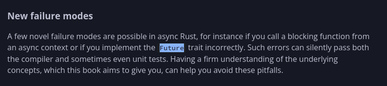

In this article, we will explore the Zeta's asynchronous model and how it:
- Avoids async infection such as in Rust and JS
- Uphold high performance and throughput guarantees
- Add safety features to async programming such as scheduler misuse detection and suspension hazards
- Enables the compiler to interact with the asynchronous runtime for suspension.
- Is not locked to a specific runtime or async model (Such as Go, where 90% of the time you're thinking in goroutines, or JS/Dart where you're thinking in async/await)
- Depending on the sense, even improve ergonomics over async/await (especially over Rust)

# Related topics before Zeta's Asynchronous Model
First of all, Zeta's asynchronous model is not a runtime or an async model. It is a compiler feature that allows you to write async code in a way that is safe and performant.

To truly understand Zeta's asynchronous model, we need to first understand why we need an asynchronous model in the first place.

## Why do we need an asynchronous model?

It's not flashy like a new memory safety model or a new language feature.

But it's the part of the language that will be used the most when you need to scale, the reason entire languages are popular (Such as Go and partially Rust).

It powers almost all the most successful services today (Such as Twitter, Netflix, and Stripe) and almost anything that needs to scale.

So to know what's really the problem, we need to understand the problem, and we'll start with Go and its scheduler and why it's not a good fit for Zeta's systematic approach.

## Go:

Go’s scheduler is built around three core components:

* **G (Goroutine):** lightweight task
* **M (Machine):** OS thread
* **P (Processor):** execution context that schedules goroutines

Go uses an **M:N scheduler**, meaning many goroutines are multiplexed across fewer OS threads while utilizing multiple CPU cores.

Each `P` has a **local run queue (LRQ)** for scheduled goroutines, while a **global run queue (GRQ)** stores unscheduled work. An `M` must be attached to a `P` to execute goroutines, and only one `M` can run on a `P` at a time.

The runtime maintains up to `GOMAXPROCS` processors (`P`s), typically based on the number of logical CPUs available. When a local queue becomes empty, work is pulled from the global queue or stolen from other processors.


### Why is this important?

Because Zeta's **standard library opt-in asynchronous runtime** is actually biased towards stackful coroutines such as **green threads** (e.g. **goroutines**), 

But what Go's model is missing, is the safety part:
- suspension hazards (What if a Lock is held and suspension happens
- scheduler misuse (What if you BLOCK on a goroutine? Prior to Go 1.14, CPU-bound goroutines could fully starve the scheduler since goroutines were only preempted at function call boundaries. Go 1.14 introduced asynchronous preemption via signals, which mitigates this - but blocking on a goroutine and holding locks across suspension remain real hazards regardless.)
- affinity issues (Thread migration, moving from Thread A to Thread B in the same goroutine)
- runtime assumptions (Thread-local storage, OS resources, execution context)

### Example hidden assumption

Many systems assume:
- thread-local storage is stable
- OS resources are thread-bound
- execution context is consistent

Go breaks these assumptions at times:

A goroutine:
- starts on thread A
- suspends
- resumes on thread B

#### Why is this a problem?

Go does provide `runtime.LockOSThread()` for cases where thread identity genuinely matters - CGo, OS-level namespaces, thread-bound OS resources. But this is an opt-in escape hatch, not a guarantee. The default behavior is migration, meaning any code that implicitly assumes thread-local identity without pinning is silently broken.

Go has also suffered from scheduler misuse: blocking synchronously inside a goroutine or holding a mutex across a channel operation can produce deadlocks that neither the compiler nor the runtime detects. (Before Go 1.14, tight CPU loops would additionally starve other goroutines entirely - asynchronous preemption fixed that specific case, but the lock and channel hazards remain.)

It has also suffered:
- [goroutine leaks that heavily increased memory usage and lead to dynamic tools existing.](https://arxiv.org/abs/2312.12002)
- [unsafe usage found in 24% of 2,438 popular Go projects, motivated primarily by OS/C interop but also performance optimization - with a complementary study finding 91% of projects transitively depend on at least one unsafe usage](https://arxiv.org/abs/2006.09973)
    - See also: [Uncovering the Hidden Dangers: Finding Unsafe Go Code in the Wild (arXiv:2010.11242)](https://arxiv.org/abs/2010.11242v1)

A lot of these are caused by a goroutine waiting on a channel that never gets closed or a lock that's never unlocked, or a context that isn't canceled properly on error paths.

Isn't this a memory safety issue? Yes, but not entirely, consider this:

```go
package main

import (
	"net/http"
	"sync"
)

var mu sync.Mutex
var jobs = make(chan int)
var results = make(chan int)

var sharedCounter int

func worker() {
	for job := range jobs {
		// worker needs lock too
		mu.Lock()
		sharedCounter += job
		mu.Unlock()

		results <- sharedCounter
	}
}

func handler(w http.ResponseWriter, r *http.Request) {
	mu.Lock()

	// simulate request data
	job := 1

	// send job to worker
	jobs <- job

	// wait for result
	res := <-results

	mu.Unlock()

	w.Write([]byte("result"))
	_ = res
}

func main() {
	go worker()

	http.HandleFunc("/", handler)
	http.ListenAndServe(":8080", nil)
}
```

This looks fine, right?

At first glance:

- mutex protects shared state
- worker processes jobs
- channel separates concerns
- HTTP handler is simple 

### The deadlock scenario (real execution)

HTTP request arrives and the handler grabs the `mu` lock right away. It tries to send the job into the channel but if the worker is busy or the buffer is full the send just blocks. So the handler ends up holding the lock while waiting on results.

The worker wakes up and pulls the job from the channel. Then it tries to lock mu but the handler still has it. This forms a cycle where each side waits on the other.

the real deadlock is simple. One thread holds the lock and waits for the results channel. The other has the job from the channel and waits for the lock.

Cycle:
- mu → results → jobs → mu

## Rust
We understood why Go's scheduler is not a good fit for Zeta's systematic approach, because technically the runtime is something liike what we want,
but the compiler is not.

This is where Rust shines, because it has one of the most sophisticated compilers in the world that is mainstream.

How does Rust handle async?  
Rust approaches the same problem from the opposite direction:
> instead of hiding execution behavior in the runtime, Rust pushes it into the type system.

Rust does not have built-in async execution at the runtime level.  
Instead, async is a compiler transformation into state machines (Future types), executed by an external runtime ([Tokio](https://tokio.rs/), [async-std](https://github.com/async-rs/async-std), etc.)

The core idea is that when you write:

```rust
async fn fetch() -> u32 {
    42
}
```

Rust transforms it into something conceptually equivalent to a state machine that implements the Future trait and is manually polled by an executor (the most common executor is Tokio)  
So instead of "running asynchronously", Rust functions become lazy computations that can be resumed after suspension points

Suspension is explicit (.await)

Unlike Go (where suspension is implicit in runtime operations), Rust forces explicit suspension:

```rust
let data = fetch().await;
```

Each .await is a potential suspension point, a compiler-marked state transition boundary AND an explicit yield to the executor

### Why is this important?
This means that Rust's async is not just about concurrency, but also about safety while preserving performance.

Rust prevents some concurrency issues such as:
#### 1. Memory safety across suspension

Rust's borrow checker prevents many classes of invalid memory access across `.await` points - dangling references, invalid stack-frame assumptions, and use-after-free in async tasks are largely caught at compile time.

However, this comes with significant complexity. Self-referential async state machines (a struct holding a reference into itself) require `Pin<P>` to be safe, since moving the struct would invalidate the internal pointer. The `Pin` API is notoriously difficult to use correctly and is one of the sharpest edges in the Rust async model. Additionally, the official async book notes that [calling a blocking function from an async context, or implementing `Future` incorrectly, can silently pass both the compiler and unit tests](https://rust-lang.github.io/async-book/01_getting_started/03_state_of_async_rust.html) - so "memory safe" does not mean "all async bugs are caught at compile time."



#### 2. Some classes of data races

Rust uses the borrow checker to manage shared mutable state through explicit synchronization with Arc<Mutex<T>>. Unsafe concurrent mutations are rejected at compile time. So it eliminates many race conditions early.

### Why is this not enough?
Well, if it was enough then this Article wouldn't exist, so what's really missing?

Zeta's inspired by this level of sophistication but this safety still doesn't prevent some logic bugs and it comes with tradeoffs:
#### Async Infection  
Async constraints can propagate upward through the architecture. This forces more of the system to become async than might conceptually be needed. It feels like a bigger issue than just syntax.

I am not totally sure, but it seems like this structural coupling comes from the async model itself.

### A naive example

```rust
pub async fn read_file(file: &str) -> Result<String, std::io::Error> {
    // async file IO
    tokio::fs::read_to_string(file).await
}

fn load_config() {
    let config = read_file("config.txt").await;
}
```

We can just add `async` to load_config, but the issue is deeper:
The real problem: infection of call hierarchy

Once a single low-level operation becomes async:
- file IO becomes async
- config loading becomes async
- initialization becomes async
- service bootstrap becomes async
- framework entry points become async

Eventually your entire program shape is dictated by whether a primitive operation is async or not.

###### Why this becomes a system-level problem

In real systems, this leads to:
- API pollution (everything becomes async even if CPU-bound)
- runtime dependency locking (you cannot easily mix sync + async code)
- architecture distortion (design follows executor constraints, not domain logic)
- hidden coupling to runtime model (Tokio, I'm looking at you)

#### No way to analyze lock and suspension behavior

once locks and async coexist, suspension propagates into critical sections, it can be held across `.await` suspension points, channels can wait inside suspension points, and dependency inversion across tasks

And it will be shown in the following example

### Real world example of a deadlock in rust

To actually replicate a Rust issue, let's look at this following code that can compile and run, but silently deadlocks.

```rust
use axum::{
    extract::State,
    routing::get,
    Router,
};
use std::sync::Arc;
use tokio::{
    sync::{Mutex, mpsc},
    time::{sleep, Duration},
};

#[derive(Clone)]
struct AppState {
    counter: Arc<Mutex<u64>>,
    tx: mpsc::Sender<Job>,
}

struct Job {
    value: u64,
    respond: mpsc::Sender<u64>,
}

#[tokio::main]
async fn main() {
    let counter = Arc::new(Mutex::new(0));

    let (tx, rx) = mpsc::channel::<Job>(100);

    let state = AppState {
        counter: counter.clone(),
        tx,
    };

    tokio::spawn(worker(rx, counter));

    let app = Router::new()
        .route("/", get(handler))
        .route("/update", get(update))
        .with_state(state);

    axum::serve(
        tokio::net::TcpListener::bind("127.0.0.1:3000")
            .await
            .unwrap(),
        app,
    )
        .await
        .unwrap();
}

async fn worker(
    mut rx: mpsc::Receiver<Job>,
    state: Arc<Mutex<u64>>,
) {
    while let Some(job) = rx.recv().await {

        let mut guard = state.lock().await;

        *guard += job.value;

        sleep(Duration::from_millis(200)).await;

        let result = *guard;

        let _ = job.respond.send(result).await;

        // lock dropped implicitly
    }
}

async fn handler(State(state): State<AppState>) -> String {
    let (resp_tx, mut resp_rx) = mpsc::channel(1);

    let mut guard = state.counter.lock().await;

    let value = *guard;

    state.tx.send(Job {
        value,
        respond: resp_tx,
    }).await.unwrap();

    // Wait for the response.. wait, the lock is actually still held
    let result = resp_rx.recv().await.unwrap();
    // We never release the lock, so the worker will never finish

    // lock released here (too late)
    *guard = result;

    "ok".to_string()
}

async fn update(State(state): State<AppState>) -> String {
    let mut guard = state.counter.lock().await;

    sleep(Duration::from_millis(100)).await;

    *guard += 10;

    "updated".to_string()
}
```

This is a classic actor-ish HTTP pipeline:

- Axum HTTP server receives requests
- shared state (counter) is protected by a mutex
- jobs are sent to a background worker via mpsc
- worker updates shared state and replies via per-request channel

So conceptually:
- HTTP handler → Job queue → Worker → Shared state → Response channel → HTTP handler

This is a request-response pipeline with shared mutable state.

This is a deadlock, but Rust will not catch it at compile time, and the explicitness and async/await infection did not save us, let's see why:

```rust
while let Some(job) = rx.recv().await {
    // Meaning: worker waits for jobs  (a place where it can pause, suspending point #1)
    let mut guard = state.lock().await;
    // Meaning: worker gets a mutex, on shared state, ok
    // worker keeps exclusive access to the global state, basically like "hands on the wheel"  
    *guard += job.value;
    // modifies shared state safely, no argument there  
    sleep(Duration::from_millis(200)).await;
}
``` 

### First critical issue

And here's the first real trouble spot: suspension while holding a mutex.

Note: the code uses `tokio::sync::Mutex`, not `std::sync::Mutex`. This distinction matters. `std::sync::Mutex` held across an `.await` would cause a different problem - it is `!Send`, so the compiler typically rejects it in async tasks (or it blocks a thread if somehow forced). `tokio::sync::Mutex` is explicitly designed to be held across `.await`, which is why the compiler accepts this code with no complaint. The deadlock here is purely a logic bug - a circular dependency - not a misuse of the lock type. That is precisely what makes it invisible to the type system.

Even if this mutex is async friendly, you still:  
- hold on to the lock for too long 
- while other tasks start piling up

It is NOT deadlock "yet".

```rust
let result = *guard;  
// reads state while the lock is still technically held  
let _ = job.respond.send(result).await;  
```

### Second critical issue

So now worker is still "morally" in the critical section, even if the code looks casual, 
and it performs an .await during a channel send

So the worker pauses while still holding the lock, and this is where we mess up in the structure, that little pause and lock combination.

```rust
// request side dependency inversion in `handler()`
let (resp_tx, mut resp_rx) = mpsc::channel(1);  
// a response channel per request, this creates a synchronization dependency tied to a single request’s lifetime

let mut guard = state.counter.lock().await;  
```

### Third critical issue

Handler now grabs the global mutex  
So now:  
handler holds the counter lock
```rust
let value = *guard; // this reads the counter value

state.tx.send(Job {  
    value,  
    respond: resp_tx,  
}).await.unwrap();
```

At that moment, the handler is still holding the mutex and it sends a job to the worker anyway

So the dependency chain becomes kinda like this:  
handler holds lock → sends job → worker depends on that same lock

```rust
let result = resp_rx.recv().await.unwrap();
```

### Fourth critical issue

Handler now:

kinda waits for worker response, but it still holds the mutex.

That ends up creating a reverse dependency cycle, which is not great.

```rust
*guard = result;
// this updates the state, still inside the lock scope so nothing is really freed, not even a little.
```

```rust
let mut guard = state.counter.lock().await;
sleep(...).await;
*guard += 10;
```

I think the main problem comes from holding the lock across a suspension point and it looks a lot like the worker pattern too. That seems to raise the odds of contention and it can also make scheduling inversion more likely in some cases.

From the dependency graph this stands out as the key part. The handler locks the counter sends the job and then waits on the response while still keeping everything locked the whole time. On the worker side it waits for the job first then grabs the lock does the suspend and sleep step and finally sends the response back. This part gets a bit messy when you try to connect the two paths together.

The hidden cycle is that the handler is holding the countr lock, and then it waits for the worker response

the worker needs that counter lock, also it depends on scheduler progress, and it may be stalled indirectly from handler pressure

Congratulations, we have achieved a ✨ deadlock in the safest mainstream language ✨  
Woohoo!

### Important note about Rust
When it comes to the memory side of the async model, Rust is one of the best languages in mainstream usage that handles it well.

You cannot easily have a memory safety issue concurrently, but you can have a logic issue concurrently, and that's what the article is about.

And the point is that stackless/stackful coroutine systems in rust can ALSO leak execution state, where suspended tasks remain indefinitely alive due to missing completion, cancellation, or scheduling conditions, even in the absence of memory safety violations.

## So.. what now?
We've talked about the two most popular languages that contain XYZ issues, and most other languages are usually a branch of one of them (C#/JS/Dart may face the same issues but without the safety that Rust brings)

Java really needs a closer look here. That callback approach you see with `thenApply` and `thenAccept` comes from the `CompletableFuture` API (which is especially present before Project Loom)

When Project Loom came around, it gave us virtual threads, so now you write blocking code with regular methods, no need for awkward `async` or `await` keywords. Under the hood, Loom runs lots of these lightweight threads (M:N scheduling), much like Go’s goroutines. But, the thing is, some old headaches stick around. If you hold a platform lock while a virtual thread is suspended, you’re in trouble. If a virtual thread waits forever on a channel that never closes, you’ve got leaks. And if you grab a synchronized block inside a virtual thread, you actually pin its carrier thread and lose that lightweight scheduling advantage. Basically, Go’s headaches are still here in Loom, just wearing a different outfit.

Erlang goes its own way with concurrency. On BEAM, each process has its own heap, and processes talk by copying messages, not by sharing memory. That makes whole classes of memory bugs much harder, the structure of the runtime enforces it. Still, Erlang isn’t bulletproof. You can run into protocol deadlocks (process A waits for B, B waits for A), mailboxes filling up with unmatched messages, or spawning so many processes you bog everything down. And if you reach for NIFs (Native Implemented Functions), then it is just as unsafe.

# Zeta's approach V1

Zeta takes a different approach, it can't just rely purely on stackful coroutines, and it can't just use async/await due to both issues, so instead of reasoning about a function based on whether it's `async` or not like in the following example:
```rust
async fn read_file(name: &str) -> Result<String, std::io::Error> {
     // ...
}

fn main() -> Result<(), std::io::Error> {
    let content = read_file("file.txt").await; // Invalid without `#[tokio::main]` and `async fn main()`
    println!("{content}");
}
```

We actually don't need to reason about whether a function is `async` or not, we can model it this way:
> `suspend` is used and it models the execution yield probability

In other words
> `suspend` means the function may yield execution

So let's write some equivalent zeta code:

```zeta
suspend fn read_file(name: &str) -> zeta::io::Error!String {
    // ...
}

fn main() -> zeta::io::Error!void {
    content := try await read_file("file.txt");
    println(content);
}
```

This will compile, but why? how will a low-level language function properly when there's no async/await (which means no hidden runtime)  
You'd be mistaken because that's **not** what zeta wants to be. Let me explain.

Zeta is a low-level language, it doesn't want to hide the runtime, it wants to be transparent about it, but as we talked, async/await has issues as well even if it is "explicit", so to understand why `main` doesn't need to be "suspend", let's study this code.

```zeta
suspend fn read_file(name: &str) -> zeta::io::Error!String {
```

This means something different than the rust example:
> Define a function that is named read_file and takes a reference to a string that is encoded in binary (not heap allocated) that can return a String or an IO error by `!` union contracts, and `read_file` may suspend and yield execution to another thread, but it is NOT asynchronous.

If this is still not understood, let's know what really is suspension
### Suspension

Suspension is the act of yielding execution to any other resource, it can be caused by:
- Parking <sup> Parking: temporarily stopping execution while preserving resumable state</sup> a stackful coroutine (for example, when epoll happens in a goroutine, that goroutine is parked)
- Waiting on a channel
- Sometimes lock contention
- Cooperative scheduling (Such as java's `Thread.yield()`)
- Async APIs such as epoll and io_uring

The difference between suspension and blocking is that when a thread is suspended, it is not blocked, it is just temporarily stopped and can be resumed later, but when a thread is blocked, the scheduler can ***reuse*** the thread it's on.

Which is what `.await` is in rust, `await` in C#/JS/Dart and what some schedulers implicitly do such as in Java and Go

### What's the difference?
Finally, we get to the interesting part, because after that explanation we can assure something that's important:  
Suspension != Asynchronous Execution

Suspension is the act of yielding execution to any other resource, but what if it's just the main thread? well, it just blocks, especially if the main thread itself is not a worker thread (which is common in constrained environments)

Let's go back to our main function in zeta:
```zeta
fn main() -> zeta::io::Error!void {
    content := try await read_file("file.txt");
    println(content);
}
```

Did you notice something? `read_file` is `suspend`, but `main` is not,  
because `read_file` might yield execution, but in the main thread,  
and the main thread is not a worker thread,  
there's no way to resume it, so it just blocks.

This is great, this means we can have the functions that work the same way,  
without "duplicating" the code (or at least the signatures) for sync and async.

## "I have a lot of questions"

Let's answer all of them.

### "What about the runtime? There needs to be a runtime for asynchronous execution."

The runtime should be a controlled and opt-in environment (similar to that of Rust)

```zeta
// Once this is started, it just starts a thread pool and executor,
// and offloads it to static memory, so if it was called AGAIN
// then it is almost entirely free
static let virtual_executor: VirtualExecutor = VirtualExecutor::start();

fn main() -> zeta::io::Error!void {
    content := virtual_executor.spawn(suspend fn() -> void {
        try await read_file("file.txt")
    });
    std::out.println(content.join());
}
```

For a low-level language, it feels wrong to hide executors like this

### How does this interact with FFI calls?
Bindings.

```zeta
// epoll wrapper FFI binding
extern "C" {
    fn epoll_create1(flags: i32) -> i32;
    fn epoll_ctl(epfd: i32, op: i32, fd: i32, event: *EpollEvent) -> i32;
    fn epoll_wait(epfd: i32, events: *EpollEvent, maxevents: i32, timeout: i32) -> i32;
    fn io_uring_wait_cqe_raw(ring: *IoUring, cqe: *IoUringCqe) -> i32;
}

// The binding author takes responsibility here
// epoll_wait can block the thread, so suspend is explicit and honest
suspend fn epoll_wait_async(epfd: i32, events: *EpollEvent, maxevents: i32) -> zeta::io::Error!i32 {
    result := epoll_wait(epfd, events, maxevents, -1);
    if result < 0 {
        return zeta::io::Error.from_errno();
    }
    return result;
}

// io_uring submission, doesn't block, nosuspend is honest
nosuspend fn io_uring_submit(ring: *IoUring, sqe: *IoUringSqe) -> zeta::io::Error!void {
    result := io_uring_submit_raw(ring, sqe);
    if result < 0 {
        return zeta::io::Error.from_errno();
    }
}

// io_uring completion wait, can block waiting for completion
suspend fn io_uring_wait_cqe(ring: *IoUring) -> zeta::io::Error!*IoUringCqe {
    unsafe {
        cqe: *IoUringCqe = undefined;
        result := io_uring_wait_cqe_raw(ring, &cqe);
        if result < 0 {
            return zeta::io::Error.from_errno();
        }
        return cqe;
    }
}
```

### If there's no async/await, and there's no state machines, then what does `await` do?
Well, nothing, literally.

It's just an explicit suspension point, and it's not async propagation because `suspend fn` functions can be used in `fn` as suspend doesn't say it's async.  
it just says it might yield execution to another resource if this (virtual) thread is controlled by the scheduler.  
by using `await` you are explicitly telling the scheduler that you acknowledge that this may suspend

### "What about non-suspend functions calling suspend? how are they handled?"
They are transitively turned suspend and inferred (just like how almost all your lifetimes in Rust are inferred)
```zeta
suspend fn read_file(name: &str) -> zeta::io::Error!String {
    // ...
}

// Tooling and compiler hint: Depends on suspending function
fn parse_config(name: &str) -> zeta::io::Error!JsonNode {
    content := try await read_file(name);
    // process content
}

// Tooling and compiler hint: Depends on suspending function
fn init_program() -> zeta::io::Error!void {
    config := try await parse_config("config.json");
    databse_data := try await parse_config("database.json");
    english_language := try await parse_config("en_US.json");
    // process content
}
```

## Dispatcher approach and its integration  with `suspend fn` functions

Zeta's executor is not a hidden scheduler like Go, Python, or JS. it is an explicit, compiler-known construct that declares its own capabilities as const statements. The compiler reads these declarations to reason about what is legal within any given execution context.
The executor is defined as a compiler-known interface:

```zeta
@compiler::Known
interface Executor {
    const CAN_SUSPEND: bool;
    const IS_SINGLE_THREADED: bool;
    const IS_REENTRANT: bool;
    const MAX_CONCURRENCY: ?usize;
    
    /// Initialize the executor
    fn start();

    /// Returns Future<T> where T is inferred from what the task returns
    /// not awaited here, just scheduled
    fn spawn<T>(task: suspend fn() -> T) -> Future<T>;

    /// Blocks the current context until the task completes
    /// used as the entry point, not for general use
    fn block_on<T>(task: suspend fn() -> T) -> T;

    /// Creates a scope where all spawned tasks must complete
    /// before the scope exits, compiler enforces this
    suspend fn scope<T>(body: suspend fn(scope: &TaskScope) -> T) -> T;
}

// Structured concurrency scope
// All tasks spawned here are children of this scope
// scope cannot exit until all children complete or are cancelled
@compiler::Known
struct TaskScope {
    executor: &Executor,
}

impl TaskScope {
    // Spawns a child task within this scope
    // Future is scoped, it cannot outlive the scope
    // compiler enforces this via lifetime-like rules
    fn spawn<T>(this, task: suspend fn() -> T) -> ScopedFuture<T>;

    // Waits for ALL tasks in the scope to complete
    suspend fn join_all(this) -> void;

    // Waits for the FIRST task to complete, cancels the rest
    // useful for racing tasks against each other
    suspend fn join_any(this) -> void;

    // Cancels all tasks in this scope
    nosuspend fn cancel_all(this) -> void;
}

// A future that cannot outlive its parent scope
// compiler errors if you try to store this outside the scope
struct ScopedFuture<T> {
    inner: Future<T>,
    _scope: &TaskScope,
}

impl<T> ScopedFuture<T> {
    suspend fn get(this) -> T { ... }
    @compiler::Pure
    nosuspend fn is_done(this) -> bool { ... }
}
```

The @compiler::Known attribute is what bridges userspace structs into the compiler's reasoning engine. The compiler does not know about any specific executor type, and it only knows the Executor trait and reads the const declarations off whatever implements it.

To see an example, let's implement the InterruptExecutor (which is intentionally limited):

```zeta
// Interrupt handler executor
// Suspension is illegal, nesting is possible
struct InterruptExecutor {}

impl Executor for InterruptExecutor {
    const CAN_SUSPEND: bool = false;
    const IS_SINGLE_THREADED: bool = true;
    const IS_REENTRANT: bool = true;
    const MAX_CONCURRENCY: ?usize = 1;

    fn start(this) { ... }
    // nosuspend propagates to tasks as well, compiler enforces this
    nosuspend fn spawn(task: nosuspend fn() -> T) -> Future<T> { ... }
    nosuspend fn block_on(task: nosuspend fn() -> void) -> void { ... }
}
```

Now, let's use it in our code:

```zeta
static let interrupt_executor: InterruptExecutor = InterruptExecutor::init();

fn handle_interrupt() -> void {
    // COMPILER ERROR: InterruptExecutor.CAN_SUSPEND = false
    // but read_file is a suspend fn
    content := interrupt_executor.spawn(nosuspend fn() -> void {
        try await read_file("file.txt")
    });
    
    interrupt_executor.spawn(nosuspend fn() -> void {
        single_threaded_task();
    });
}

fn single_threaded_task() -> void {
    // InterruptExecutor.IS_SINGLE_THREADED = true
    // compiler can prove no other task runs concurrently here
    // lock elision is valid, compiler may warn that this mutex is redundant
    mutex := Mutex::new(0);
    guard := try await mutex.lock();
}
```

How is this possible?

Transitive suspension solves it, because non-suspend functions can be called from suspend functions, the compiler takes over for this inference (which is really easy and can be done during IR lowering) and the compiler can prove that no other task runs concurrently here.

But suspension is a lot wider than asynchronous execution in general, so when you want to do something like this:

### Why can't we just do the same with our traditional async/await?
Because in async/await, suspension is implied by syntax not declared as behavior.Because in async/await, suspension is implied by syntax not declared as behavior. The compiler knows a suspension point exists at every `await` but it knows nothing about what that suspension means.

Let's take this example:
```rust
async fn do_work() {
    let mutex = std::sync::Mutex::new(0);
    let guard = mutex.lock().unwrap();
    
    // Rust actually catches this one specific case
    // but only because MutexGuard is !Send, not because
    // it understands suspension semantics
    some_io().await;
    
    drop(guard);
}
```
Rust understood this and could block it, yes, but that's because it was !Send, not because it understood suspension semantics.

If it WAS `Send`:
```rust
async fn do_work() {
    // tokio's mutex IS Send, so this compiles fine
    // but you just held a mutex across a yield point
    // in a single threaded executor, this is a deadlock
    // in a multi threaded executor, this might be fine
    // the compiler has absolutely no idea which situation you're in
    let mutex = tokio::sync::Mutex::new(0);
    let guard = mutex.lock().await;
    
    some_io().await; // guard held across here, deadlock possible
    
    drop(guard);
}
```

The deadlock potential of holding guard across some_io().await is completely different between these two mains. In the single threaded case it's almost certainly a deadlock. In the multi threaded case it might be fine. The compiler sees identical code in both cases and says nothing.
```rust
// You also can't reason about WHY something suspends
// all of these look identical to the compiler at the suspension level
some_io().await;                // suspending for I/O readiness
channel.recv().await;           // suspending waiting on a channel  
mutex.lock().await;             // suspending on lock contention
tokio::task::yield_now().await; // explicitly yielding cooperatively

// And there's no way to declare "this function must never suspend"
// you can write nosuspend conceptually but the language has no way to enforce it
fn definitely_not_suspending() {
    // nothing stops someone from calling this from async context
    // and nothing stops this from calling async code via block_on
    // which may panic at runtime if already inside a runtime
    tokio::runtime::Handle::current().block_on(some_async_fn());
}
```

Additionally, even if we basically just rename `suspend` to `async`, `suspend` is still more honest in general:
```zeta
// suspend is honest
suspend fn read_file(name: &str) -> zeta::io::Error!String {
    // I might yield, that's all I'm saying
    // the dispatcher decides what that means
    // the caller doesn't need to change
    // no state machine, no future, no polling
}

// async would be a lie
async fn read_file(name: &str) -> zeta::io::Error!String {
    // implies: I run concurrently
    // implies: I return a Future<String> not a String
    // implies: you need an executor to drive me
    // implies: caller must be async too
    // none of this is true in the model
}
```

Even if you manage to remove the necessity of `async` from `fn` functions and you can use `async fn` functions in `fn` functions, you basically just recreated my model, but best case scenario is that it is less honest in general (a lock suspension is not async for example, trying to reason about it with the same model but `suspend` is named `async` would be misleading), worst case scenario is that you don't even have the same guarantees as this model.

### Real world application of Zeta's Async Model

Let's "rewrite" the Rust HTTP Server code in Zeta, assuming all the libraries do exist: (This is a rough sketch and may not accurately reflect real zeta Syntax)

```zeta
struct AppState {
    counter: Arc<VirtualMutex<u64>>,
    tx: mpsc::Sender<Job>,
}

struct Job {
    value: u64,
    respond: mpsc::Sender<u64>,
}

static let virtual_executor: VirtualExecutor = VirtualExecutor::start();

fn main() -> zeta::io::Error!void {
    counter := Arc::new(VirtualMutex::new(0));
    (tx, rx) := mpsc::channel<Job>(100);

    state := AppState {
        counter: counter.clone(),
        tx,
    };

    virtual_executor.spawn(suspend fn() -> void {
        await worker(rx, counter);
    });

    app := Router::new()
        .route("/", get(handler))
        .route("/update", get(update))
        .with_state(state);

    try await axum::serve(
        try await TcpListener::bind("127.0.0.1:3000"),
        app,
    );
}

suspend fn worker(
    rx: mpsc::Receiver<Job>,
    state: Arc<VirtualMutex<u64>>,
) -> void {
    while let Some(job) = try await rx.recv() {
        guard := try await state.lock(); // acquires lock
        *guard += job.value;
        await sleep(Duration::from_millis(200));
        result := *guard;
        try await job.respond.send(result);
        // guard dropped here
    }
}

suspend fn handler(state: AppState) -> zeta::io::Error!String {
    (resp_tx, resp_rx) := mpsc::channel(1);

    // guard is acquired and held
    guard := try await state.counter.lock();
    value := *guard;

    try await state.tx.send(Job {
        value,
        respond: resp_tx,
    });

    // COMPILER ERROR: suspension cycle detected
    //
    // handler holds: state.counter (VirtualMutex)
    //   -> suspended at: resp_rx.recv()
    //      waiting for: worker to send on job.respond
    //
    // worker:
    //   -> suspended at: state.counter.lock()
    //      waiting for: handler to release state.counter
    //
    // handler cannot resume until worker sends
    // worker cannot resume until handler releases the lock
    // neither can make progress
    //
    // suspension cycle: handler -> worker -> handler
    result := try await resp_rx.recv();

    *guard = result;
    return "ok";
}

suspend fn update(state: AppState) -> zeta::io::Error!String {
    guard := try await state.counter.lock();

    // no cycle here, sleep does not depend on any lock
    // held by another suspended task
    // compiler sees no suspension cycle, this is fine
    await sleep(Duration::from_millis(100));

    *guard += 10;
    return "updated";
}
```

This is almost the same example as the Rust code, The intentional deadlock is in `handler` and it would never compile, let's break it down and see how the theoretical Zeta compiler would catch it:
#### Step 1: Lock liveness tracking

The compiler tracks guard as a live lock on state.counter from acquisition to drop:
```zeta
guard := try await state.counter.lock(); // lock live from here
// ...
result := try await resp_rx.recv();      // suspension point while lock is live
// ...
*guard = result;
// guard dropped here, lock released
```

`VirtualMutex.HOLD_ACROSS_SUSPEND = ALLOWED` so holding across a suspension point is not an error by itself. The compiler doesn't stop here.

#### Step 2: Suspension dependency graph

Because `await` is an explicit acknowledgment marker, the compiler knows exactly where each task suspends and what it is waiting on:
```
handler suspends at resp_rx.recv()
  -> unblocked by: worker sending on job.respond
  -> condition: worker must reach job.respond.send()

worker suspends at state.counter.lock()
  -> unblocked by: handler releasing state.counter
  -> condition: handler must drop guard
```

#### Step 3: Cycle detection

The handler progress requires that `worker` sends job.response, meanwhile the worker progress requires that `handler` releases state.counter, and handler will release the lock only after resp_rx.recv() returns, and resp_rx.recv() returns only after worker sends job.respond

This is how the cycle works.

#### Step 4: Why update is fine
```zeta
suspend fn update(state: AppState) -> zeta::io::Error!String {
    guard := try await state.counter.lock();
    await sleep(Duration::from_millis(100)); // suspension point
    *guard += 10;
    return "updated";
}
```

The compiler checks: what does sleep depend on? Nothing that depends on state.counter. There is no task suspended waiting for update to release its lock while update is sleeping. The suspension graph has no cycle here so it compiles cleanly.

### Limitations of this Asynchronous Model
I have explained why this async-model is great, but I haven't explained the disadvantages (over modern research and maybe even current solutions):

#### Inapplicable for stackless coroutines (unless adjusted)
The language doesn't produce state machines, even though it has explicit awaits which can help reason about it to the scheduler and compiler, it's just a regular function call that doesn't produce magic.

#### Has the limitations of Stackful coroutines
This can include memory overhead, etc.

#### It doesn't reason about blocking code well
This is mostly for reasoning about suspension from locks, and benefitting syscalls like io_uring, etc, but when blocking appears then it falls under that limitation (as suspension is different than blocking, whereas suspension may stop the code but the scheduler can just park it and other tasks run fine, while blocking will block the whole OS thread). Can this be reasoned about via monomorphization? We'll see.

#### Only statically analyzable deadlocks and cycles can be proven
Let's say you have this function pointer:
```zeta
suspend fn handler(state: AppState) -> zeta::io::Error!String {
    guard := try await state.counter.lock();
    
    // cycle is through a function pointer or trait object
    // compiler cannot see what this actually calls at runtime
    try await (state.callback)();
}
```

Well, you can't know which pointer this goes to, so the compiler would need to go out of the way to ignore this, or execute this under `unsafe`

#### FFI and stdlib should be disciplined about the first `suspend` points
If there are no `suspend` points, the language can't reason about any suspension

Similarly, The compiler is blind about the async-safety and guarantees coming from FFI calls (like Rust is blind to the memory guarantees coming from FFI calls), so we must be disciplined like we saw in the previous FFI examples we have shown.

### The end
This is how Zeta will track suspensions, and we established that:
- No state machines are implemented (zeta is biased towards stack**full** coroutines), which may improve compile times and debuggability
- The performance is as fast as the scheduler will allow (The compile doesn't produce any magic)
- The code can scale as you don't need to duplicate the code
- The code can be safely validated by the compiler directly with minimal additions to lowering and the type system, without a separate (dynamic/static) external tool like Rust and Go

#### Sources:
- [Diving deep into Goroutines](https://vaibhavahuja.github.io/understanding-goroutines)
- [The main source code of the Go scheduler](https://go.dev/src/runtime/proc.go)
- [What Color is Your Function? - Bob Nystrom (2015)](https://journal.stuffwithstuff.com/2015/02/01/what-color-is-your-function/)
- [Uncovering the Hidden Dangers: Finding Unsafe Go Code in the Wild (arXiv:2010.11242)](https://arxiv.org/abs/2010.11242v1)
- [Go 1.14 Release Notes - Asynchronous Preemption](https://tip.golang.org/doc/go1.14)
- [The State of Asynchronous Rust - The Async Book](https://rust-lang.github.io/async-book/01_getting_started/03_state_of_async_rust.html)
- [Futures and the Async Syntax - The Rust Book](https://doc.rust-lang.org/book/ch17-01-futures-and-syntax.html)
